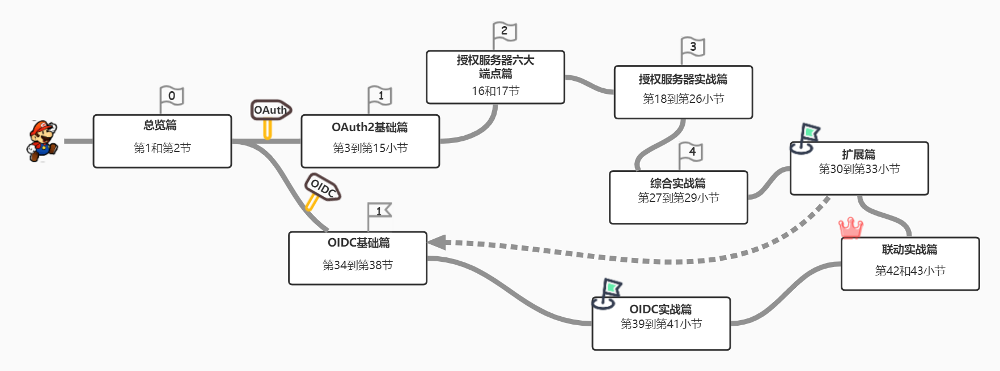

# oauth2inaction
implement the authorization server step by step

**本小册的主要目的是关注概念，是让你从根儿上理解OAuth 授权服务器的实现，它与具体的语言无关。因此，我决定使用Spring Boot来实现本书示例中使用的OAuth 2.0授权服务器。 然而，在实践中，您可以使用Keycloak、Auth0、Okta、WSO2等作为授权服务器。在本专栏的结尾，我为你演示了如何用Keycloak、Django OAuth Toolkit、Spring Authorization Server构建授权服务器** 

## 一、通识篇

### 1 ■ 追根溯源——身份认证和访问授权的发展历史
### 2 ■ OAuth 2.0与OIDC
### 3 ■ OAuth 2.0的四大角色
### 4 ■ 客户端注册——客户端如何与授权服务器产生联系
### 5 ■ 权限范围（Scope）和作用域令牌
### 6 ■ 授权码模式
### 7 ■ 授权码模式之授权请求和令牌请求
### 8 ■ PKCE和授权码模式
### 9 ■ 客户端模式
### 10 ■ 不再被推荐的模式——简化模式和密码模式
### 11 ■ 刷新你的访问令牌
### 12 ■ JWT、JWE和JWS
## 二、授权服务器端点篇
### 13 ■ 授权服务器端点之授权端点和令牌端点
### 14 ■ 授权服务器的其他端点

## 三、实战篇：从零实现一个生产可用的授权服务器
[授权服务器全景图](https://www.processon.com/view/link/63a5215f6376897d8479106a)
### 15 ■ 初始化我们的授权服务器项目
### 16 ■ 客户端管理和授权服务器元信息端点
### 17 ■ 实现授权端点以及授权许可端点
### 18 ■ 实现令牌端点
### 19 ■ 实现令牌内省端点和令牌撤销端点
### 20 ■ 让我们的授权服务器支持PKCE
### 21 ■ 授权服务器支持JWT结构化令牌
### 22 ■ 实现一个资源服务器
### 23 ■ 实现一个客户端，验证我们的授权服务器

## 四、OAuth 2.0进阶篇
### 24 ■ OAuth安全性及最佳实践
### 25 ■ 在移动应用程序中使用OAuth 2.0
### 26 ■ 无浏览器和输入受限设备中的OAuth 2.0
### 27 ■ 实战：使用OAuth 2.0保护微服务安全
## 五、OIDC篇
### 28 ■ OIDC和身份认证流
### 29 ■ OIDC的四个标准scope
### 30 ■ 从OpenID Provider请求和获取用户声明
### 31 ■ 实战篇：使我们的授权服务器支持OIDC协议
### 32 ■ 实战篇：实现UserInfo端点
### 33 ■ 实战篇：使用OpenID Connect保护基于React的单页面应用程序
### 34 ■ 实战篇：OpenID Connect和服务端应用程序集成
### 35 ■ 如何登出你的应用

## 六、扩展篇
### 36 ■ OAuth 2.0为什么被称为授权框架——扩展你的OAuth
### 37 ■ 关于授权服务器的实现还有哪些优秀的选择 —— Keycloak、oauthlib和Spring Authorization Sever
### 38 ■ 客户端如何接入授权服务器（上） —— 新浪微博小助手连接新浪微博
### 39 ■ 客户端如何接入授权服务器（下）—— Spring Security OAuth2 Client定制和源码解析
### 40 ■ 总结